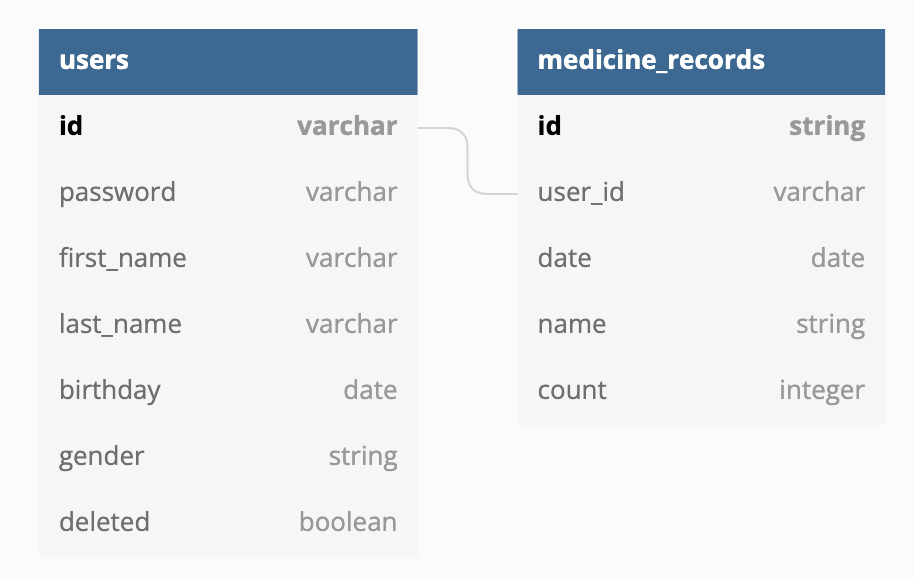

# Introduction
这个是医疗点计划的后端的设计。

# Database
这是database构造。



# API 
## Methods
### GET
|Method|Endpoint|Description|Request|
|-|-|-|-|
|GET|/|后端的基本资料|[Root](#)|
|GET|/user/\<id\>|根据id获取客户资料|[Get User](#get-user)|
|GET|/user/\<id\>/medicine?[q](#query-strings)|读取客户医疗历史list|[Mecidine Records](#medicine-records)|

### POST
|Method|Endpoint|Description|Request|
|-|-|-|-|
|POST|/user|新用户|[Create user](#create-user)|
|POST|/medicine|新药登陆|[Create Medicine Record](#create-medicine-record)|

### DELETE
|Method|Endpoint|Description|Response|
|-|-|-|-|
|DELETE|/user/\<id\>|取消用户|[Delete user](#delete-user)|


## Query strings
以下是可能的Query Strings。

请根据他们的存在和值决定怎么query database。

|Key|Type|Example|Description|
|-|-|-|-|
|agg|string|total|如果是total,就是想要统计的结果。看[这](#medicine-records)。|
|date|date|10-12-2019|data的最后的一天|
|range|string|30|从第一天的data的日子。ie 30就是要从最后一天到30天之前的医疗资料|
|med|list|protein,potato|选择要什么类似的药。利用例子就是要database的”protein“和”potato“而已的药|

## Response Body
这块文档储存前段期待服务器回复的资料构造。

### Root
这端口主要看能不能访问API。
apiVersion的定义可以参考[semver](https://semver.org/lang/zh-CN/)

Status Code 200。

```json
{
    "apiVersion": "v0.1.0",
    "name": "明晶可爱API",
    "description": "这是我老婆最可爱的API"
}
```

### Get User
这端口从后段取出来用户资料。

**客户id**存在的话。Status Code 200。

```json
{
    "id": "justin93",
    "first_name": "Jer Wei",
    "last_name": "Yeoh",
    "password": "LWMgcGFzc3dvcmQK",
    "birthday": "1993-03-19",
    "deleted": "false"
}
```

**客户id**不存在的话。Status Code 404。

```json
{
    "type": "user not found",
    "message": "user of id justin93 does not exist",
}
```

### Medicine records

这是根据客户ID取出来客户的医疗历史。

没统计状态下 (agg不存在):

Status Code 200:

```json
[
    {
        "id": "40kd01id-09dk-1038-blzx-aks91kdjsz",
        "date": "11-02-2020",
        "name": "protein",
        "count": 3
    },
    {
        "id": "asdf1oka-0391-4029-poej-leliqpxkna",
        "date": "11-03-2020",
        "name": "protein",
        "count": 1
    },
    ...
]
```

统计状态下 (agg=total存在):

Status Code 200:

```json
[
    {
        "name": "protein",
        "total": 30
    },
    {
        "name": "potato",
        "total": 20
    },
    ...
]
```

**客户id**不存在的话。Status Code 404。

```json
{
    "type": "user not found",
    "message": "user of id justin93 does not exist",
}
```

### Delete user
删除户口时利用url里的id来做判断。

删除户口时，把deleted的flag改成true就行了。

Status Code: 200
```json
{
    "type": "success",
    "message": "user has been deleted"
}
```

**客户id**不存在的话。Status Code 404。

```json
{
    "type": "user not found",
    "message": "user of id justin93 does not exist",
}
```

## Request Body
这是前段会给后段发的Request构造。

### Create user
```json
{
    "id": "justin93",
    "first_name": "Jer Wei",
    "last_name": "Yeoh",
    "password": "KZks018vojxka",
    "birthday": "19-03-1993",
    "gender": "male",
}
```

#### Response

要是id已经存在

Status Code: 409

```json
{
    "type": "user id already exist",
    "message": "user id justin93 already exist"
}
```

要是没问题

Status Code: 201
```json
{
    "type": "success",
    "message": "user id justin93 has been created"
}
```

### Create Medicine Record
```json
{
    "user_id": "justin93",
    "name": "protein",
    "date": "20-12-2020",
    "count": "3"
}
```

#### Response

要是user_id不存在

Status Code: 404

```json
{
    "type": "user not found",
    "message": "user of id justin93 does not exist",
}
```

要是没问题

Status Code: 201
```json
{
    "type": "success",
    "message": "medicine record has been created"
}
```
